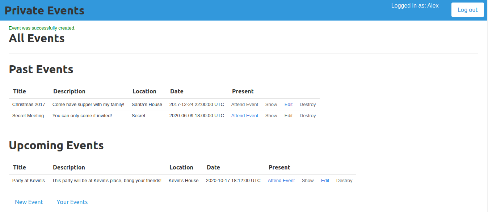

# Private Events Web App

The main objective of this project was to build an events application such as `EventBrite`. This was supposed to demonstrate a mastery in working with `Rails Associations`. Here, a User can be both a creator and attendee of an event and an Event has many attendees. To accomplish this `many-to-many` relationship, we had to create an inner join table called `attendance`.

## Getting Started
- Clone the repository using `git clone git@github.com:abouhid/private-events.git`
- Change directories into the location to which you cloned the repo using `cd`
- Run `bundle install` and `rails db:migrate`
- Run `rails s` to start the rails `puma` server
- On your browser go to http://localhost:3000/

## Instructions
Once inside the application, you have to create an account since you are a new user so as to be able to enjoy all that the web app has to offer. Once you've created the application, you can use the navigation links to navigate anywhere within the page.

## Built With
- Ruby on Rails version 6.0.0.3

## Authors

👤 **Alexandre Bouhid**

- Github: [karthick](https://github.com/karthykarthick)
- LinkedIn: [karthick-harimoorthy](https://www.linkedin.com/in/karthick-harimoorthy/)

## 🤝 Contributing

Contributions, issues and feature requests are welcome!

Feel free to check the [issues page]().

## Show your support

Give a ⭐️ if you like this project!

## Acknowledgments

- Microverse
- GitHub
- TheOdinProject
- Ruby on Rails :tada
